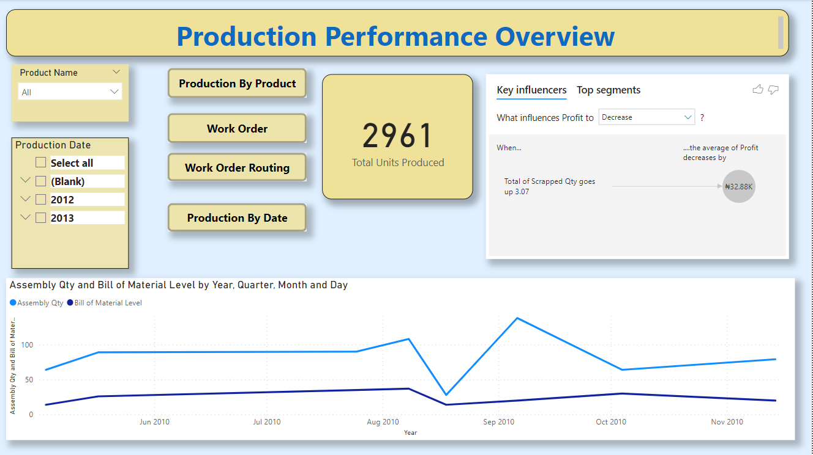
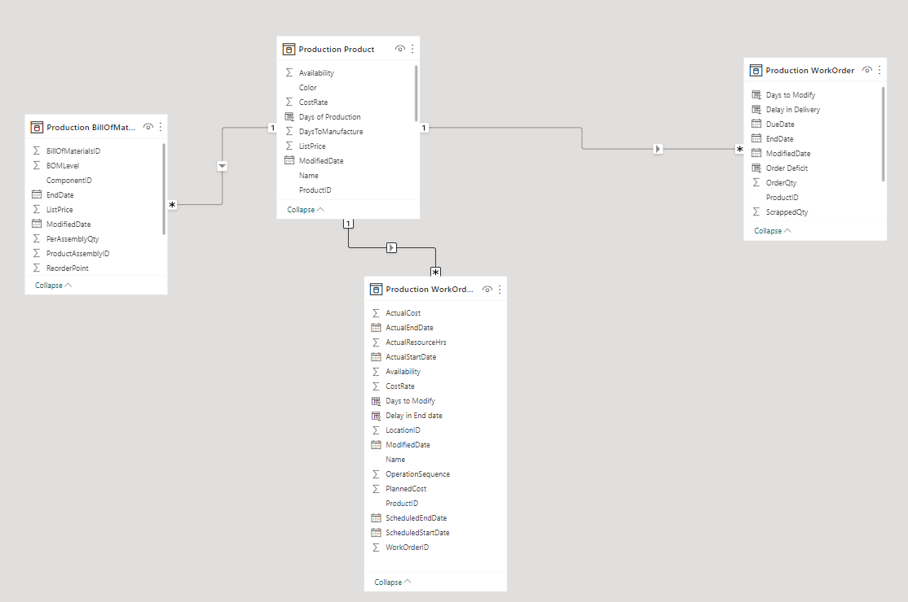
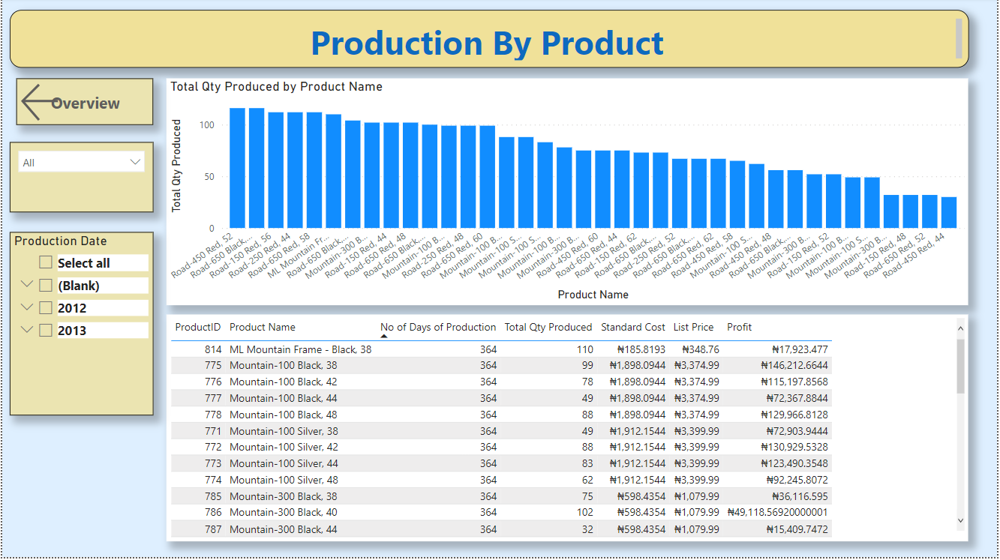
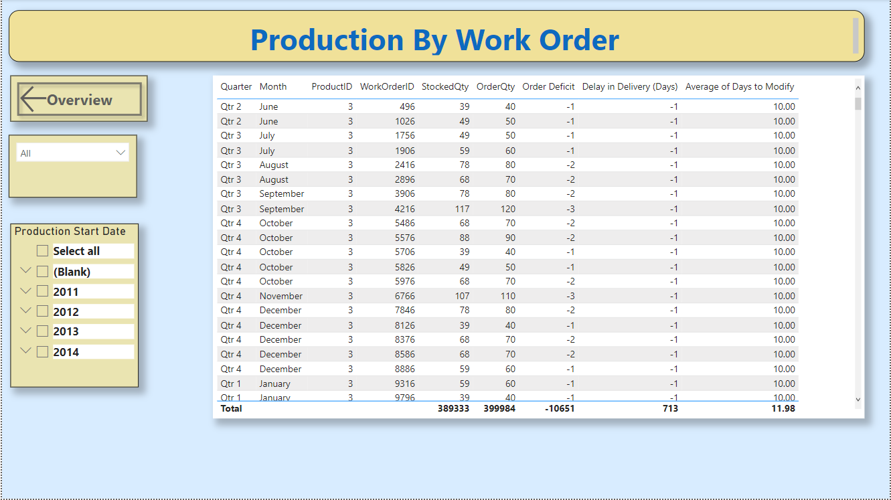
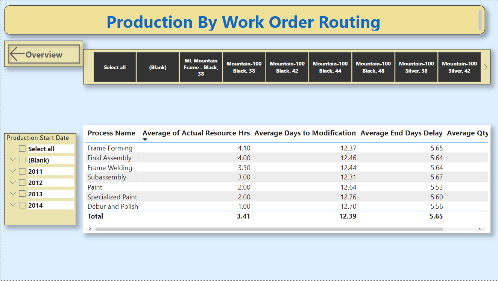
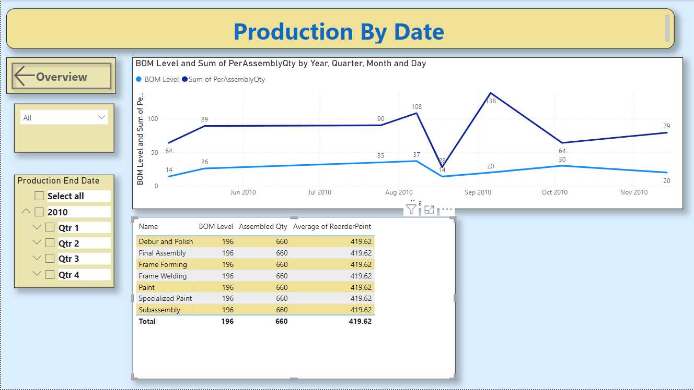

# Project1
# Analysis of Production Performance 

Total Units of items Produced is 2961
---
## Introduction
This is a Power Bi Project of the Production Analysis of a **Manufacturing Company**
The Project is to analyze and derive insights to answer crucial questions and make 
the company make data driven decision

_Disclaimer_ : _Datasets from the Mircosoft Adevtureworks database. Used to demomstrate my learnings and capabilities
with Proving Data Driven Decisions woth power BI_

# Objecive:
To provide insights into production performance by various categories and time periods

# Problem Statement
1. What Product categories contributed to the highest production performance
2.  What time period did the highest production performance occur?

# Skills and Concepts demonstrated:
The following Power BI features were incorporated
- Getting data from the server (Microsoft based)
- Modelling relationships with tables
- DAX and Calculated Measure
- Page Navigation and Button

**Get data**
Data was requested using server method via the local host computer

**The Model is a star schemma**
**Modelling**
D

**The Model is a star schemma**

## Visualization
The report comprises 5 pages:
1. Overview
2. Production By Product
3. Production B Work Order
4. Production By Work Order Routing
5. Production By Date

You can interact with the report [here](https://app.powerbi.com/groups/me/reports/1a8e3174-c32d-4335-8106-e1f66041eeb4/ReportSection1ae8ff6bbf1920352db2?experience=power-bi)

## Production By Product

The items with Produc ID 758 and 766 were the most produced at 116 units

## Production By Work Order

Average number of days to make modification to the units was at 10 days

## Production By Work Order Routing

On the average, there was 5.65 deays to the scheduled end date

## Production By Date

The Highest aseembled quanity occured around Sep 2010

